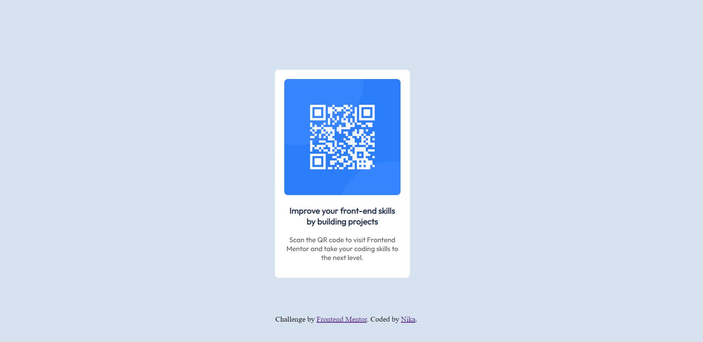

# Frontend Mentor - QR code component solution

This is a solution to the [QR code component challenge on Frontend Mentor](https://www.frontendmentor.io/challenges/qr-code-component-iux_sIO_H). Frontend Mentor challenges help you improve your coding skills by building realistic projects. 

## Overview
This is a QR code component built with HTML and CSS.

### Screenshot

### Links

- Live Site URL: [Add live site URL here](https://your-live-site-url.com)

## My process

### Built with
HTML5
CSS

### Useful resources

- [Coverting colors](https://convertingcolors.com) - This helped me convert colors from HSL to HEX.

## Author

- Website - [Nika](https://nikakl.github.io/CV/)
- Frontend Mentor - [@NIKAKL](https://www.frontendmentor.io/profile/NIKAKL)
